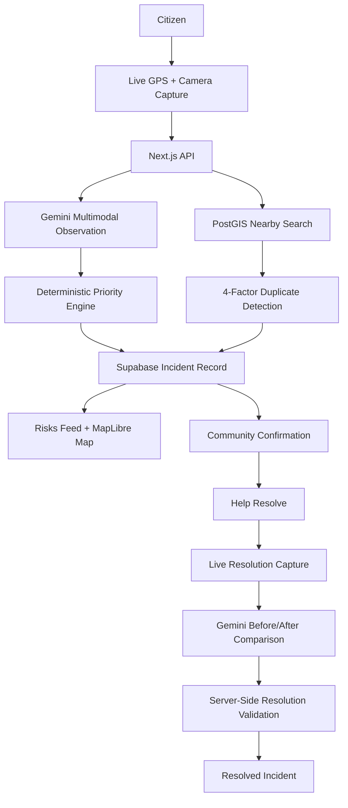

# ProofFix 🛡️

> **Live Demo:** [https://prooffix.vercel.app/](https://prooffix.vercel.app/)

ProofFix is a community-driven civic issue reporting and verification platform designed to make civic reports more trustworthy, less repetitive, and easier to prioritize.

Citizens report real-world issues using live camera capture and device geolocation. Google Gemini extracts structured observations from the evidence, while ProofFix's deterministic scoring engine calculates urgency. PostGIS identifies nearby reports, and multi-factor duplicate detection can convert repeat reports into independent community confirmations instead of duplicate tickets.

ProofFix also supports proof-of-resolution: a new on-site capture is compared against the original evidence before an incident is marked resolved.

---

## 🎯 Why ProofFix?

Most civic reporting systems answer:
> **"How do we submit complaints?"**

ProofFix focuses on a different question:
> **"How do we know the report is current, distinct, important, and actually resolved?"**

ProofFix connects the entire lifecycle into a verifiable evidence trail:

$$\text{Live Evidence} \longrightarrow \text{Location Context} \longrightarrow \text{AI Observation} \longrightarrow \text{Deterministic Priority} \longrightarrow \text{Duplicate Detection} \longrightarrow \text{Community Confirmation} \longrightarrow \text{Resolution Verification}$$

---

## 📑 Table of Contents

- [The Problem](#-the-problem)
- [How ProofFix Works](#-how-prooffix-works)
  - [1. Fresh Evidence Capture](#1-fresh-evidence-capture)
  - [2. Multimodal AI Observations (Gemini)](#2-multimodal-ai-observations-gemini)
  - [3. Deterministic 100-Point Priority Engine](#3-deterministic-100-point-priority-engine)
  - [4. PostGIS 4-Factor Smart Duplicate Detection](#4-postgis-4-factor-smart-duplicate-detection)
  - [5. Searchable Location Discovery & Risk Map](#5-searchable-location-discovery--risk-map)
  - [6. Proof-of-Resolution Visual Audit](#6-proof-of-resolution-visual-audit)
- [System Architecture](#-system-architecture)
- [Tech Stack](#-tech-stack)
- [Database & Schema](#-database--schema)
- [API Reference](#-api-reference)
- [Security & Trust Model](#-security--trust-model)
- [Getting Started Locally](#-getting-started-locally)

---

## 🚨 The Problem

Traditional municipal complaint portals and civic apps face critical operational bottlenecks:

1. **Unverifiable & Stale Complaints**: Users upload old gallery photos from unrelated events or downloaded images.
2. **Ticket Clutter & Redundant Spam**: Dozens of residents file separate tickets for the same single pothole or fallen tree.
3. **Subjective Prioritization**: Critical safety hazards (e.g., dangling live wires near schools) get lost in flat, unprioritized queues.
4. **Weak Resolution Verification**: A ticket status may change without enough evidence that the physical issue has actually been addressed.

---

## 💡 How ProofFix Works

### 1. Fresh Evidence Capture
- **Live Device Geolocation**: Captures real-time device coordinates (`latitude`, `longitude`, `accuracy`) via `navigator.geolocation` and reverse-geocodes them to the real locality.
- **Direct WebRTC Camera Stream**: Streamed straight from device camera sensors. Removes direct gallery-upload reuse and strengthens the freshness and authenticity of reported evidence.

### 2. Multimodal AI Observations (Gemini)
- Sends captured image bytes to **Google Gemini** (`gemini-3.8-flash`).
- Extracts structured physical observations:
  - Road blockage & traffic disruption level (`none`, `minor`, `moderate`, `severe`)
  - Live or hanging electrical wire hazards
  - Overhead structural/falling hazards
  - Chemical, sewage, or wastewater contamination
  - Deep sinkholes, craters, or road cave-ins

### 3. Deterministic 100-Point Priority Engine
> **Core Architectural Rule**: *Gemini observes; deterministic code decides the score.*

Gemini extracts physical observations, but the final numerical score ($0$ to $100$ pts) is deterministically calculated by code:

$$\text{Total Score} = \text{Human Safety} + \text{Environmental Risk} + \text{Public Obstruction} + \text{Confirmations} + \text{Time Unresolved}$$

| Scoring Dimension | Max Points | Evaluation Factors |
|---|---|---|
| **Human Safety** | **40 pts** | Live wire hazard (+30), deep cave-in (+25), structural fall hazard (+20) |
| **Environmental & Health** | **25 pts** | Contaminated wastewater or chemical hazard (+25) |
| **Public Obstruction** | **15 pts** | Major road blocked (+15), single lane blocked (+10), passage blocked (+5) |
| **Community Confirmations** | **10 pts** | 2 pts per unique neighbor verification |
| **Time Unresolved** | **10 pts** | Escalates automatically over time if left unaddressed |

### 4. PostGIS 4-Factor Smart Duplicate Detection
When a new report is initiated:
1. PostGIS queries for open incidents within a **30-meter radius** (`ST_DWithin`).
2. If nearby candidates exist, a multi-factor weighted evaluation runs:
   - **Location Proximity (30%)**
   - **Category Similarity (25%)**
   - **Visual Similarity (35%)** (via Gemini visual comparison)
   - **Time Proximity (10%)**
3. **Smart Conversion**: If similarity $\ge 80$, the user is shown the existing issue and prompted to add an **Independent Confirmation** instead of creating a duplicate ticket.

### 5. Searchable Location Discovery & Risk Map
- **Geoapify Address Autocomplete**: Fast, debounced (400ms) city and locality search across India (`/api/location-search`).
- **MapLibre GL Interactive Canvas**: Renders live PostGIS coordinates with severity-coded pins (`Critical`, `High`, `Medium`, `Resolved`).
- **Isolated Telemetry**: Browsing different cities in discovery mode does not modify the user's reporting GPS state.

### 6. Proof-of-Resolution Visual Audit
- Anyone in the community or municipal staff can assist in resolving an issue.
- **On-Site Proximity Check**: The resolver must physically be within 50m of the original incident coordinates.
- **Before vs. After Gemini AI Comparison**: Gemini compares the original report image against the newly captured resolution frame to confirm the hazard is cleared.
- Status securely transitions from `open` $\rightarrow$ `resolved` upon verified proof.

---

## 🏗️ End-to-End Workflow Architecture



---

## 💻 Tech Stack

| Layer | Technology | Purpose |
|---|---|---|
| **Framework** | Next.js 14 (App Router) | Server-rendered React application & API routes |
| **Language** | TypeScript | Strict type safety and robust API contracts |
| **Styling** | Tailwind CSS | Civic design system with mobile-responsive layouts |
| **Database** | PostgreSQL + PostGIS | Geospatial indexing & spatial queries (`ST_DWithin`, `ST_Distance`) |
| **Platform** | Supabase | Managed PostgreSQL, Row-Level Security, Auth, Storage |
| **Authentication** | Supabase Auth (OAuth) | Google OAuth with session persistence |
| **AI / Vision** | Google Gemini API (`gemini-3.8-flash`) | Multimodal image understanding & visual comparison |
| **Mapping** | MapLibre GL | Interactive vector and raster map rendering |
| **Geocoding** | Geoapify Autocomplete API | Debounced address and locality search across India |

---

## 🗄️ Database & Schema

ProofFix uses Supabase PostgreSQL with the PostGIS extension for geospatial operations.

> The complete production schema, including PostGIS indexes, RLS policies, confirmation triggers, storage policies, and RPC functions, is available in [`supabase/schema.sql`](./supabase/schema.sql).

### Core Tables Conceptual Overview

```sql
-- Public Incidents Table with PostGIS Geography Point
CREATE TABLE public.incidents (
  id UUID PRIMARY KEY DEFAULT gen_random_uuid(),
  reporter_id UUID REFERENCES public.profiles(id) ON DELETE SET NULL,
  title TEXT NOT NULL,
  description TEXT NOT NULL,
  category TEXT NOT NULL,
  severity TEXT NOT NULL CHECK (severity IN ('low', 'medium', 'high', 'critical')),
  status TEXT NOT NULL DEFAULT 'open' CHECK (status IN ('open', 'in_progress', 'resolved')),
  location GEOGRAPHY(Point, 4326) NOT NULL,
  latitude DOUBLE PRECISION NOT NULL,
  longitude DOUBLE PRECISION NOT NULL,
  location_accuracy DOUBLE PRECISION,
  city TEXT,
  address_text TEXT,
  primary_image_url TEXT NOT NULL,
  ai_observations JSONB DEFAULT '{}'::jsonb,
  priority_breakdown JSONB DEFAULT '{}'::jsonb,
  confirmation_count INTEGER DEFAULT 1,
  captured_at TIMESTAMPTZ DEFAULT NOW(),
  created_at TIMESTAMPTZ DEFAULT NOW(),
  updated_at TIMESTAMPTZ DEFAULT NOW()
);

-- Spatial GIST Index for Sub-Millisecond 30m Proximity Queries
CREATE INDEX idx_incidents_location ON public.incidents USING GIST (location);
```

---

## 📡 API Reference

| Method | Endpoint | Description | Auth Required |
|---|---|---|---|
| `GET` | `/api/incidents` | Fetch incidents filtered by `city`, `severity`, or `status` | Public |
| `POST` | `/api/incidents` | Submit verified incident with storage upload | **Yes (Google OAuth)** |
| `POST` | `/api/analyze-incident` | Send raw image bytes to Gemini Multimodal AI | Optional |
| `POST` | `/api/confirm-incident` | Add neighbor confirmation & increment counter | **Yes** |
| `POST` | `/api/verify-resolution`| Submit on-site resolution photo for AI audit | **Yes** |
| `GET` | `/api/location-search` | Geoapify debounced autocomplete (India) | Public |
| `GET` | `/api/geocode` | Reverse geocode coordinates to locality/city | Public |

---

## 🔒 Security & Trust Model

- **Server-Isolated Credentials**: `SUPABASE_SERVICE_ROLE_KEY`, `GEMINI_API_KEY`, and `GEOAPIFY_API_KEY` are executed strictly in server runtime (`import 'server-only'`) and are never bundled into client JS.
- **Session-Derived Identity**: The server derives authenticated user IDs directly from Supabase auth session tokens. Client-provided `reporter_id` fields in JSON payloads are ignored to prevent spoofing.
- **Row-Level Security (RLS)**: Client database updates are constrained by Supabase RLS policies. Privileged mutations (e.g. status changes upon resolution) execute through server validation.
- **Anti-Self-Confirmation**: PostgreSQL triggers and application logic prevent original reporters from confirming their own submissions.

---

## 🚀 Getting Started Locally

### 1. Prerequisites
- Node.js 18.x or 20.x
- npm / yarn / pnpm

### 2. Installation

```bash
# Clone the repository
git clone https://github.com/Itz-Nisanth/ProofFix.git
cd ProofFix

# Install dependencies
npm install
```

### 3. Environment Configuration

Create a `.env.local` file:

```env
# Google Gemini Multimodal AI
GEMINI_API_KEY=your_gemini_api_key_here
GEMINI_MODEL=gemini-3.8-flash

# Supabase PostgreSQL + PostGIS Config
NEXT_PUBLIC_SUPABASE_URL=https://your-project.supabase.co
NEXT_PUBLIC_SUPABASE_ANON_KEY=your_supabase_anon_key_here
SUPABASE_SERVICE_ROLE_KEY=your_supabase_service_role_key_here

# Geoapify Autocomplete & Geocoding (Server-Only)
GEOAPIFY_API_KEY=your_geoapify_api_key_here
```

### 4. Database Setup

Execute the schema and PostGIS functions located in [`supabase/schema.sql`](./supabase/schema.sql) inside your Supabase SQL Editor.

### 5. Run Development Server

```bash
npm run dev
```

Visit [http://localhost:3000](http://localhost:3000).

---

## 📦 Building for Production

```bash
npm run build
npm run start
```

---

<p align="center">
  <b>ProofFix</b> — Verifiable civic reporting and resolution.
</p>
